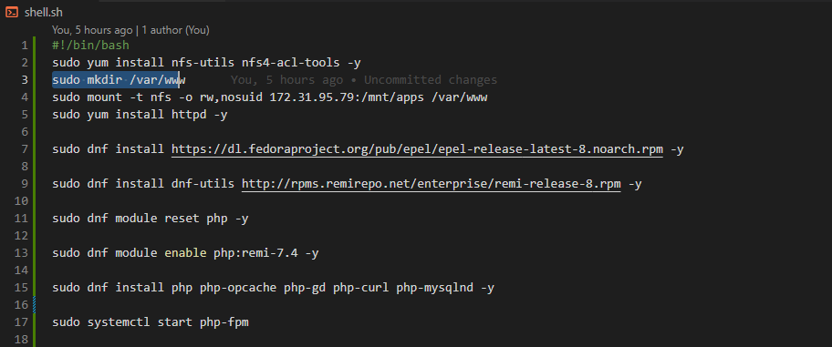

## STEP 1 – PREPARE NFS SERVER
`sudo gdisk /dev/xvdf`

`sudo gdisk /dev/xvdg`

` sudo yum install lvm2`

`sudo lvmdiskscan`

`sudo pvcreate /dev/xvdf1`

`sudo pvcreate /dev/xvdg1`

`sudo vgcreate nfsserver-vg /dev/xvdf1 /dev/xvdg1`

`sudo lvcreate -n lv-apps -L 6G nfsserver-vg`

`sudo lvcreate -n lv-logs -L 6G nfsserver-vg`

`sudo lvcreate -n lv-opt -L 6G nfsserver-vg`

`sudo mkfs -t xfs /dev/nfsserver-vg/lv-apps`

`sudo mkfs -t xfs /dev/nfsserver-vg/lv-logs`

`sudo mkfs -t xfs /dev/nfsserver-vg/lv-opt`

`sudo mkdir -p /mnt/apps`

`sudo mkdir -p /mnt/logs`

`sudo mkdir -p /mnt/opt`

`sudo mount /dev/nfsserver-vg/lv-apps /mnt/apps`

`sudo mount /dev/nfsserver-vg/lv-logs /mnt/logs`

`sudo mount /dev/nfsserver-vg/lv-opt /mnt/opt`

`sudo yum -y update`

`sudo yum install nfs-utils -y`

`sudo systemctl start nfs-server.service`

`sudo systemctl enable nfs-server.service`

`sudo systemctl status nfs-server.service`

`sudo vi /etc/fstab`

##  Permission That Will Allow Our Web Servers To Read, Write And Execute Files On NFS

`sudo chown -R nobody: /mnt/apps`

`sudo chown -R nobody: /mnt/logs`

`sudo chown -R nobody: /mnt/opt`

`sudo chmod -R 777 /mnt/apps`

`sudo chmod -R 777 /mnt/logs`

`sudo chmod -R 777 /mnt/opt`

`sudo systemctl restart nfs-server.service`

`sudo vi /etc/exports`

`sudo exportfs -arv`

## STEP 2 — CONFIGURE THE DATABASE SERVER

`sudo apt update`

`sudo apt install mysql-server`

`sudo mysql`

`create database tooling;`

`create user "webaccess"@"%" identified with mysql_native_password by "password";`

`grant all on tooling.* to "webaccess"@"%";`

`flush privileges;`
## Step 3 — Prepare the Web Servers

`sudo vi shell.sh && sudo chmod +x shell.sh`

`sudo vi /etc/fstab`

`172.31.95.79:/mnt/apps /var/www nfs defaults 0 0`

` sudo vi /etc/sysconfig/selinux`

`SELINUX=disabled`

`sudo vi functions.php`

`mysql -h 172.31.81.114 -u webaccess -ppassword tooling < tooling-db.sql`

`sudo vi /etc/mysql/mysql.conf.d/mysqld.cnf`

